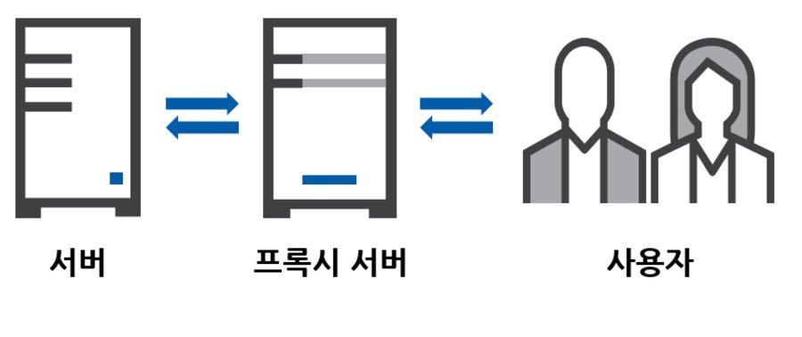

# 🤔`RESTful`이란
- `REST`의 기본 원칙을 성실히 지킨 웹 서비스를 의미합니다.

## 1. 📕단어 사전적 의미

### `REpresentational`
- **구상화**, 재현적

### `State`
- **상태**

### `Transfer`
- (동사) 옮기다, 이송하다, **이동하다**.
- (명사) 이동, 이적

### `-ful`
- ~이 가득한, ~의 성격을 지닌, **~의 경향이 있는**
- ~을 가득 채울 정도의 양

> 네이버 사전

# 🧐`REST`는 무엇인가?

- 분산 하이퍼 미디어 시스템(`Distributed Hypermedia Systems`)을 위한 소프트웨어 아키텍쳐입니다.
- 효율이고 안정적으로 확장 가능한 분산시스템을 가져올 수 있는 소프트웨어 아키텍처 디자인 제약의 모음을 나타냅니다.
- `HTTP`에서 쿠기나 세션 트랙킹 같은 별도의 전송 계층 없이 전송하기 위한 간단한 인터페이스입니다.

# 😓`REST`의 기본 원칙

## 1. 🧷균일한 인터페이스 (`Uniform Interface`)
- 리소스에 대한 요청이 HTTP 표준 프로토콜에 따른다면, 특정 언어나 장치, 기술에 종속되지 않습니다.

## 2. 🧷클라이언트-서버 (`Client-Server`)
- 클라이언트와 서버가 서로 간에 독립적이며, 각 역활이 명확하고 서로 간의 의존성이 줄어듭니다.
- 클라이언트는 서버에게 리소스 요청(`requset`)만을 수행하며, 서버는 HTTP를 통해 요청된 데이터를 전달(응답 `response`)하는 것 말고는 클라이언트을 수정하지 않아야 합니다.

## 3. 🧷`Stateless`
- 서버가 클라이언의 세션(`session`)을 보존하지 않음을 의미합니다.
- 서버는 클라이언트 요청과 관련된 데이터를 따로 저장하지 않습니다.
- 따라서, 클라이언트 요청에 서버가 처리에 필요한 모든 정보를 포함해야 합니다.

## 4. 🧷캐싱 가능성 (`Cacheable`)
- HTTP 프로토콜이 가진 캐싱 기능을 적용할 수 있습니다.
- 서버 응답에 전달된 리소스에 대해 캐싱을 허용되는 지 여부에 대한 정보도 포함되어야 합니다.
- 대량의 요청을 효율적으로 처리할 수 있습니다.
- 서버측의 확장성이 증가하고 클라이언트측의 성능 향상을 동시에 얻을 수 있습니다.

## 5. 🧷계층화 시스템 (`Layered System`)



- 클라이언트와 서버 사이 승인된 중개자 서버인 `Proxy`서버를 사용할 수 있습니다.
- 보안, 로드밸런싱, 암호화 등 계층을 추가하여 구조 변경이 가능합니다.

## 6. 🧷자체 표현 구조 (`Self-Descriptive`)
- 메시지만으로 무슨 행위를 하는 지 알 수 있으며, 해당 메세지에 대한 설명이 가능해집니다.

# 🙂`REST API`란

- REST 아키텍처 스타일을 따르는 `API`를 `REST API`라고 합니다. 

## 1. `REST API` 구성 요소
```
http://example.com/people/2
📨request message
GET /people/2 HTTP/1.1
...
{ "name": "kim", "age": "19" }
```

### 1-1. 🫙리소스(`Resource`) : `URI`(`Uniform Resource Identifier`)

`http://example.com/people/2`

- `people`
- `2`
- 각 리소스들은 URI로 식별됩니다.

### 1-2. 🦾행위(`Verb`) : `HTTP Method`

- `GET`
- 생성, 조회, 수정, 삭제등 어떠한 행위에 대한 식별을 합니다.

### 1-3. 🆎표현(`Verb`) : `HTTP Method`
- `{ "name": "kim", "age": "19" }`
- 클라이언트와 서버간 데이터를 주고 받을 때, 리소스에 대한 정보를 `json`, `XML`형태로 전달합니다.
- 서버는 클라이언트에 대한 요청을 응답으로 상태코드를 전달합니다.

> 응답 상태코드란? 특정 HTTP 요청이 성공적으로 완료되었는지 알려줍니다.

> [상태 코드의 종류](https://developer.mozilla.org/ko/docs/Web/HTTP/Status)

# 😀`REST API`를 사용 시 이점

## 1. 🧷확장성
- 클라이언트-서버 상호 작용을 최적화하기 때문에 효율적으로 크기 조정할 수 있습니다.
- `Stateless`와 캐싱을 통해 성능을 저하 시키는 병목 현상을 일으키지 않으면서 확장성을 가지게 됩니다.

## 2. 🧷유연성
- 완전한 클라이언트-서버 분리를 지원하여 독립적으로 발전할 수 있도록 다양한 서버 요소를 단순화하고 분리합니다.
- 서버측이 변형이 되더라도 클라이언트측에는 그에 대한 영향을 받지 않습니다.

## 3. 🧷독립성
- API 설계에 영향을 주지 않고 다양한 프로그래밍 언어로 클라이언트 및 서버 애플리케이션을 모두 작성할 수 있습니다.
- 통신에 영향을 주지 않고 양쪽의 기본 기술을 변경할 수 있습니다.

# 😦`URI` 명명규칙

## 1. ✍️리소스는 명사를 사용해서 표현한다.
```
✅http://example.com/users
✅http://example.com/topics
```

## 2. ✍️단어간 구분은 하이픈(`-`)를 사용한다.
```
🚫http://example.com/userManagement
// 대문자 사용
🚫http://example.com/user_management
// 언더바는 브라우저 주소창에서 잘 보이지 않아 가독성을 해친다.
✅http://example.com/user-management
```

## 3. ✍️파일 확장자를 표시하지 않는다.
```
🚫http://example.com/photo1.jpg
🚫http://example.com/topic1.html
✅http://example.com/photos/1
✅http://example.com/topics/1
```

## 4. ✍️`CRUD`와 같은 행위를 포함하지 않는다.
```
🚫http://example.com/read/topics/1
🚫http://example.com/add/topics
🚫http://example.com/modify-topics
🚫http://example.com/delTopic
```

### 🧷`HTTP Metod`를 통해 행위를 표현해야 한다.

```html
✅http://example.com/topics/1

<a href="/topics/1">link</a>
<!-- 📨request message
GET /topics/1 HTTP/1.1
Accept: text/html,application/xhtml+xml
Accept-Encoding: gzip, deflate, br
Accept-Language: ko,en;q=0.9,en-US;q=0.8
Cache-Control: max-age=0
Host: 127.0.0.1:5500
User-Agent: Mozilla/5.0 ...
-->
```

```html
✅http://example.com/topics

<form action="/topics" method="post">
   <input type="text" name="title">
   <input type="submit"/>
</form>
<!-- 📨request message
POST /topics HTTP/1.1
Accept: text/html,application/xhtml+xml
Accept-Encoding: gzip, deflate, br
Accept-Language: ko,en;q=0.9,en-US;q=0.8
Cache-Control: max-age=0
Host: 127.0.0.1:5500
User-Agent: Mozilla/5.0 ...

title: restful 👈 body 값
-->
```

### 5. ✍️리소스를 필터링은 `Query string`를 이용한다.
- `Query string`는 `http://example.com/topics?name1=value&name2=value`형태로 주소와는 `?`이후에 속성의 이름과 값이 표시되며, 속성 간의 구분은 `&`로 이루어진다.
```
✅https://www.google.com/search?q=올해의+영화
// 구글에서 "올해의 영화"를 검색
✅https://www.youtube.com/results?search_query=영화&sp=EgIYAw%253D%253D
// 유튜브에서 "영화"를 검색, 필터 : 4~20분.
```

# 🌐 참고 사이트

- [ibm](https://www.ibm.com/kr-ko/topics/rest-apis)
- [amazon](https://aws.amazon.com/ko/what-is/restful-api/)
- [mozilla](https://developer.mozilla.org/ko/docs/Web/HTTP/Messages)